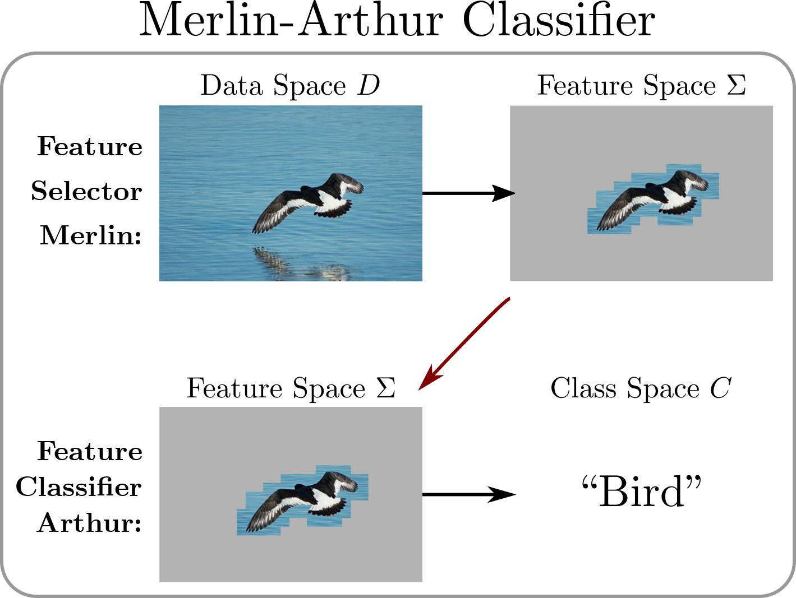

# Interpretabilty Guarantees with Merlin-Arthur Classifiers [AISTATS 2024]
Authors: [Stephan Wäldchen](https://stephanw.net/), [Kartikey Sharma](https://kartikeyrinwa.github.io/), [Berkant Turan](https://b-turan.github.io/), [Max Zimmer](https://maxzimmer.org/), [Sebastian Pokutta](http://www.pokutta.com/)

## Introduction
<div align="center">

</div>


This repository is dedicated to the implementation of the Merlin-Arthur Classifiers, a multi-agent interactive classifier framework aimed at enhancing interpretability in machine learning models. The work is detailed in our paper [*Interpretabilty Guarantees with Merlin-Arthur Classifiers*](https://arxiv.org/abs/2206.00759) presented at AISTATS 2024, which introduces a novel approach to interpretability guarantees, inspired by the Merlin-Arthur protocol from Interactive Proof Systems.

The framework is demonstrated using two datasets: the MNIST and the UCI Census dataset, with a setup that includes a verifier (Arthur) and two provers (Merlin and Morgana). These roles are performed by various algorithms, including U-Nets, Stochastic Frank-Wolfe (SFW) optimizers, or brute force search methods, which participate in a min-max game aimed at refining the classification process.


Interpretability is key to trust and ethical decision-making in AI, and our project aims to contribute in this domain. This repository offers the tools, instructions, and insights necessary for engaging with our approach, replicating our experiments, and potentially extending the methodology to new contexts. We welcome contributions, feedback, and collaborative efforts from the community to further this goal.


## Table of Contents
- [Introduction](#introduction)
- [Getting Started](#getting-started)
  - [Setting up the Environment](#setting-up-the-environment)
  - [Initializing `wandb`](#initializing-wandb)
- [Usage](#usage)
  - [Regular Training](#regular-training)
  - [Merlin-Arthur Training](#merlin-arthur-training)
  - [Advanced Features](#advanced-features)
- [Dataset](#dataset)
- [Models](#models)
- [Results](#results)
- [Citing](#citing)
- [Contributing](#contributing)
- [Acknowledgments](#acknowledgments)
- [Contact](#contact)

## Getting Started


### Setting up the Environment

1. **Clone the repository** to your local machine:

   ```bash
   git clone https://github.com/yourusername/merlin-arthur-classifiers.git
   cd merlin-arthur-classifiers
   ```

2. **Create and activate the Conda environment** using the provided `env.yml` file. This file contains all the necessary libraries and their versions:

    ```
    conda env create --file env.yml -n merlin-arthur 
    conda activate merlin-arthur
    ```

### Initializing `wandb`
After installing [`wandb`](https://wandb.ai/site), you need to login and initialize it in your project. Run the following command and follow the prompts to log in:
```bash
wandb login
```
This will require you to enter your API key, which you can find in your wandb dashboard under your profile settings.


## Basic Usage

This section outlines how to use the Merlin-Arthur Classifiers framework to replicate our results or apply the classifier to new data. The repository supports several training methods and datasets. Choose the approach and dataset relevant to your needs. 
Available training approaches are: `regular`, `sfw`, `mask_optimization`, and `unet`. Specify the desired approach through the command line argument when executing the training script `main.py`.

### Regular Training 
Regular training can be conducted on two datasets: MNIST and UCI Census. Below are basic commands for each. To explore additional configurations, please have a look on the `config_files\arg_parser.py` file.

Debug mode can be activated using the command line argument `--debug` together with the other command line arguments. This executes the code running on two batches instead of the entire dataset. In the following examples, we show how to execute the code in the `debug mode`.

To save the checkpoint of the best model, you can add the `--save_model` flag. Be sure to change the save path to successfully save the checkpoint.

#### MNIST Dataset (`debug mode`)

To perform regular training on the `MNIST` dataset :

```bash
python main.py --debug --seed 42 --approach regular --use_amp --dataset MNIST --epochs 10 --batch_size 512 --binary_classification --lr 0.001 --model_arthur SimpleCNN --add_normalization --wandb
```
#### UCI Census Dataset (`debug mode`)

For the UCI Census dataset, we need to change the `--dataset` and `--model_arthur` flags:

```bash
python main.py --debug --seed 42 --approach regular --use_amp --dataset UCI-Census --epochs 10 --batch_size 512 --binary_classification --lr 0.001 --model_arthur UCICensusClassifier --add_normalization --wandb
```
### Merlin-Arthur Training
After saving a pre-trained Arthur classifier locally, the next step is to go through the Merlin-Arthur training process. In this phase, Merlin and Morgana are introduced to a strategic min-max game to refine and improve the interpretability of the classification process.

Merlin-Arthur Training features a collaborative interaction between Merlin and Arthur, alongside a min-max game dynamic with Morgana challenging Arthur. In this constellation, Morgana strives to maximize Arthur's loss, while Arthur strives to minimize it. This three-player interaction enhances the interpretability of the classificaiton process through its adversarial approach. Additionally, the training framework is designed for versatility, allowing customization to specific datasets (e.g., `MNIST`, `UCI Census`) and tailored training methodologies (e.g., `unet`, `sfw`, `mask_optimization`). 

To initiate Merlin-Arthur training, specify the approach, dataset, and other relevant parameters when executing the `main.py` script. Below are examples for different scenarios.

**Customization Options**
- **Debug Mode:** Activated by adding --debug, running the script on a smaller subset for quicker iterations.
- **Model Configuration:** Adjust `--mask_size`, `--lr`, `--gamma`, `lr_merlin` , `lr_morgana` and other parameters to fine-tune the training process.
- **Checkpoint Loading**: Adjust `--pretrained_path` to load the checkpoint of the pretrained Arthur.


##### MNIST Dataset with U-Net Approach (`debug mode`)
For training using the U-Net approach on the MNIST dataset:

```bash
python main.py --debug --seed 42 --approach unet --segmentation_method topk --use_amp --dataset MNIST --epochs 15 --batch_size 512 --binary_classification --mask_size 64 --lr 0.001 --gamma 2 --model_arthur SimpleCNN --pretrained_arthur --pretrained_path YOUR_MODEL_PATH --add_normalization --wandb --lr_morgana 0.001 --lr_merlin 0.001
```

##### MNIST Dataset with Stochastic Frank-Wolfe Approach (`debug mode`)
To use the SFW approach for the MNIST dataset:
```bash
python main.py --debug --seed 42 --approach sfw --segmentation_method topk --use_amp --dataset MNIST --epochs 15 --batch_size 512 --binary_classification --mask_size 32 --lr 0.01 --gamma 2 --model_arthur SimpleCNN --pretrained_arthur --pretrained_path YOUR_MODEL_PATH --add_normalization --wandb --lr_morgana 0.01 --lr_merlin 0.01
```
##### UCI Census Dataset with SFW Approach (`debug mode`)
For applying the Merlin-Arthur Training with the SFW approach on the UCI Census dataset:
```bash
python main.py --debug --seed 42 --approach sfw --segmentation_method topk --use_amp --dataset UCI-Census --epochs 2 --batch_size 512 --binary_classification --mask_size 3 --lr 0.01 --gamma 2 --model_arthur UCICensusClassifier --pretrained_arthur --pretrained_path YOUR_MODEL_PATH --add_normalization --wandb --lr_morgana 0.01 --lr_merlin 0.01
```
### Advanced Features

The Merlin-Arthur Classifiers framework provides a range of advanced configuration options to fine-tune the training process according to specific research needs or objectives. These options include a variety of regularization techniques and alternative loss functions, allowing for extensive customization of the model's behavior and optimization criteria.

#### Custom Loss Functions and Optimization

- **Optimize Probabilities**: Enable optimization directly on the probabilities by setting `--optimize_probabilities`.
- **Alternative Loss Function**: Utilize the loss function proposed by Dabkowski et al. (2017) with `--other_loss`.

#### Regularization Techniques

To further refine the model and control overfitting, the following regularization penalties can be applied:

- **L1 Penalty**: Introduce sparsity in the model parameters with `--l1_penalty` and specify the coefficient with `--l1_penalty_coefficient`.
- **L2 Penalty**: Add regularization to reduce model complexity using `--l2_penalty`, adjusting its impact via `--l2_penalty_coefficient`.
- **Total Variation (TV) Penalty**: Enhance the model's generalization by incorporating a TV penalty for spatial smoothness with `--tv_penalty`, specifying the coefficient with `--tv_penalty_coefficient` and adjusting the penalty power for SFW with `--tv_penalty_power`.

These advanced features are designed to empower users to experiment with and optimize the Merlin-Arthur Classifiers framework for their unique use cases, enhancing both performance and interpretability.

For a comprehensive list of all available options and further details on how to configure these features, please refer to the `config_files\arg_parser.py` file within the repository.

## Dataset
The MNIST dataset will be downloaded and saved to `.data/MNIST` or `.data/CustomMNIST`. The raw UCI-Dataset will be first downloaded and saved to `.data/adult.data` for training and `.data/adult.test` for testing, correspondingly. The dataset will then be preprocessed and saved to `.data/sex_target_encoded_data_train.pkl` and `.data/sex_target_encoded_data_test.pkl` if `sex` is the target feature. If you want to skip the preprocessing steps, you can set `read_pre_processed=False` in the data preparation located in `merlin_arthur_framework.py` 


## Models
In the framework, we offer a diverse array of models, each tailored to accommodate different requirements and research interests. These models range from simple convolutional neural networks (CNNs) to more complex architectures like ResNet and U-Net variants. Below is a brief overview of the models available:

- `ResNet18`: A modification of the classic ResNet18 model for customizable input channels and class numbers, supporting pre-trained weights for transfer learning.

- `DeeperCNN`: An extended CNN architecture designed for more complex image processing tasks, featuring multiple convolutional and fully connected layers.

- `SimpleCNN`: A straightforward CNN model for basic image classification tasks, with a simple stack of convolutional, pooling, and fully connected layers.

- `Net`: A basic neural network with convolutional and pooling layers, tailored for simple image classification problems.

- `SimpleNet`: An adaptable architecture combining U-Net-like downscaling and upscaling with a flexible output mechanism, suitable for tasks requiring detailed spatial understanding.

- `UCICensusClassifier`: A neural network specifically designed for classifying categorical data, illustrating the framework's capability to handle non-image data.

- `SaliencyModel`: A reproduction of the model from [Dabkowski et al.](https://arxiv.org/abs/1705.07857), designed to generate saliency maps for highlighting decision-critical areas in images, emphasizing interpretability.

These models exemplify the framework's versatility, catering to a wide range of machine learning and computer vision tasks. Users can easily adapt these models for their specific projects or extend them to explore new research directions.


## Entropy
The lower bound and precision of the pretrained Merlin-Arthur-Framework can be calculated using the `main_entropy.py` script. This loads the saved models of Arthur and Merlin and calculates the corresponding metrics. Note that the flags need to be set accordingly to setup each agent.

## Results (TODO)
Summarize the key findings from your experiments, including tables or graphs if possible.

## Citing
```bibtex
@InProceedings{waldchen2023formal,
  title={Interpretability Guarantees with Merlin-Arthur Classifiers},
  author={W{\"a}ldchen, Stephan and Sharma, Kartikey and Turan, Berkant and Zimmer, Max and Pokutta, Sebastian},
  booktitle = {International Conference on Artificial Intelligence and Statistics},
  year = {2024},
  organization = {PMLR},
}
```

## Acknowledgments
Credit any collaborators, institutions, or funding bodies that supported the work.


